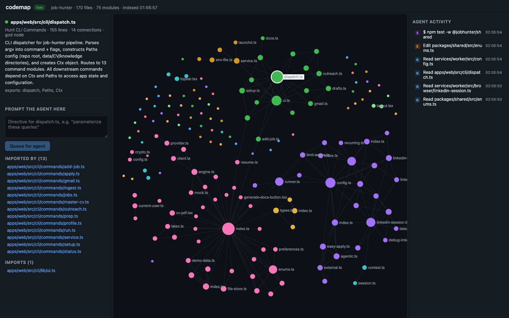

# codemap

A living knowledge graph of your codebase, shared by you and your coding agent.

Agents read it as **memory** over MCP: one tool call returns the architecture of a repo instead of a fresh exploration every session. You watch it as **telemetry**: a live map where nodes light up as the agent reads and edits files. Both of you use it as a **prompting surface**: click a file's node, type a directive, and the agent receives it bundled with everything the graph knows about that file.



The screenshot above is codemap watching a live Claude Code session work on a 170 file repo: the selected node's summary and dependents on the left, the agent's activity streaming on the right, touched nodes flashing on the map.

## Why

Working with coding agents today has three problems that are really one problem: neither of you can see the shape of the codebase.

1. **Agents re-explore constantly.** Every new session greps and reads its way to the same understanding the last session had, then forgets it.
2. **Agent output is a wall of text.** You cannot glance at it and know what part of your system the agent is touching.
3. **Steering is imprecise.** Telling an agent where to work means describing locations in prose.

codemap builds one artifact, a code graph with import edges, detected modules, and LLM summaries, and gives it three faces: MCP tools for the agent, a live map for you, and node-anchored directives connecting the two.

## How it works

```
indexer  ──►  .codemap/graph.json  ──►  mcp server  ──►  any MCP agent
                     │
                     ▼
              live server (Yjs) ◄── PostToolUse hook (agent telemetry in)
                     │          ──► UserPromptSubmit hook (directives out)
                     ▼
                  web ui
```

- **indexer**: maps any repo, whatever it is made of. JavaScript and TypeScript get precise import resolution through the TypeScript compiler; Python, Dart, and Markdown get dedicated resolvers (imports, package and relative paths, links and wiki links); Go, Rust, Java, Ruby, and the rest get best-effort import matching; and every text file is a node either way, with unlinked files grouped into modules by directory. Louvain community detection finds the modules, the most connected files become god nodes, and summaries come through the `claude` CLI so it reuses your existing login. Re-indexing is incremental by content hash, and the live server re-indexes automatically on file change so the map never lies.
- **mcp server**: `get_overview`, `node_context`, `search_nodes`, and `impact_of` (transitive dependents of a file, the thing grep cannot tell you). Works with any MCP client.
- **live server**: a Yjs CRDT sync host. The graph, the agent event stream, and pending directives are one shared document, so every open browser sees the same live state and updates arrive with no polling.
- **web ui**: sigma.js force graph colored by module, node inspector with summaries and dependency lists, live activity feed, and a prompt composer on every node.

## Numbers from a real repo

Measured on a 170 file TypeScript monorepo with Claude Code running `claude-haiku-4-5` headless:

- `get_overview` returns the full architecture briefing, all 75 modules with summaries plus the most connected files, in one tool call of about 4,300 tokens.
- The same orientation without codemap took the agent 17 tool-use turns of grepping and file reading.
- Asked which files depend on the central enum hub, the codemap-assisted run answered from `impact_of` with the exact transitive dependent list. The unassisted run had to rediscover it by reading files, and that knowledge evaporates when the session ends.

An honest note: on small repos, raw token cost is similar either way, because exploration is cheap when there is little to explore. The win is orientation speed, dependency precision, and the fact that the graph persists across sessions while an agent's exploration does not. The gap grows with repo size.

## Quick start

Install once:

```bash
curl -fsSL https://raw.githubusercontent.com/hassanatic/codemap/main/install.sh | bash
```

Then, inside any project:

```bash
codemap up --summaries
```

That one command indexes the repo, wires the Claude Code hooks into
`.claude/settings.local.json`, adds `.codemap/` to your `.gitignore`,
registers the MCP server once for all your projects, and serves the live map
at http://localhost:4401. It is idempotent, so run it again any time and it
only changes what is missing.

## What needs what (no API keys, ever)

codemap has no keys, accounts, or configuration of its own. Everything runs
on your machine:

- **Indexing and the map**: plain parsing and graph math. Needs node 20+ and
  git, nothing else. Works offline.
- **Summaries** (`--summaries`): the one AI-powered feature. It shells out to
  your installed `claude` CLI, so it reuses whatever login Claude Code
  already has (subscription or key). codemap never sees or stores
  credentials. No `claude` CLI means summaries are skipped and everything
  else still works.
- **Telemetry, node directives, MCP memory**: local plumbing. Hooks POST
  events to localhost, the MCP server reads the graph file. The model doing
  the coding is your own Claude Code session, authenticated and billed
  exactly as it already is; codemap adds no calls of its own.

Now run `claude` in the project like normal. Files flash on the map as the
agent reads and edits them, and clicking any node lets you send it a directive
anchored to that file. Manual setup steps, if you prefer doing it yourself,
are in [docs/setup.md](docs/setup.md).

## Scope and roadmap

v1 maps any local repo with file-level nodes: precise edges for JS/TS, resolver-based edges for Python, Dart, and Markdown, best-effort edges elsewhere. Next, roughly in order:

- function-level nodes and call edges
- hosted agent sessions through the Claude Agent SDK for instant mid-run steering instead of next-prompt delivery
- precise parsers (tree-sitter) for the languages that currently get best-effort matching
- paste a GitHub URL to explore any repo

## License

MIT
